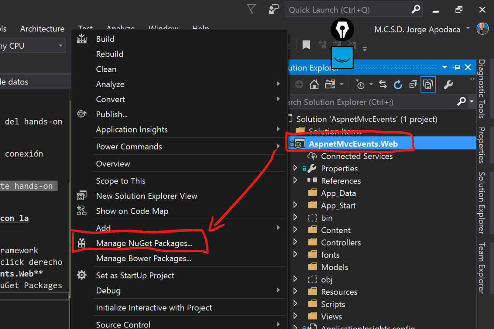
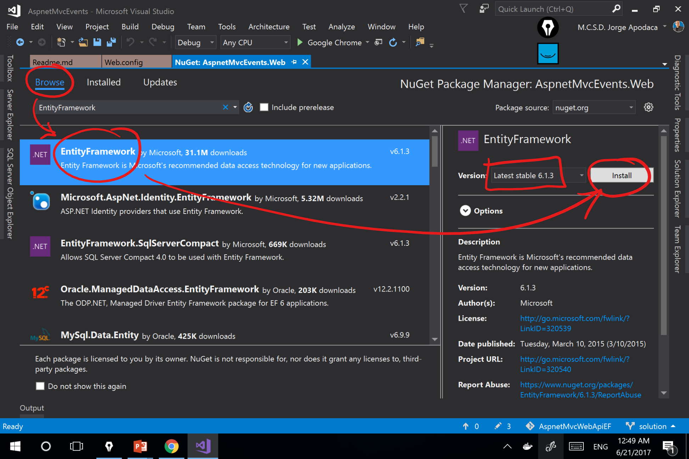
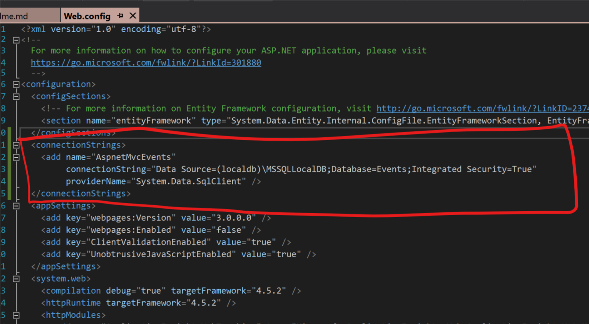

# Hands-On-Lab

### Caso de Estudio

Se procedera a crear un sitio web basado en ***ASP.NET MVC***, en donde se lleve el control de registro de eventos y presentadores en una convención, registrando dicha informacion por medio de un ***ORM*** como lo es ***Entity Framework*** alojandola en ***SQL Server Express Edition***.

#### Ejercicios

Realizar los siguientes ejercicios del hands-on lab:

1. Preparar la solución web con la conexión hacia la base de datos

> Tiempo estimado para terminar este hands-on lab: **120 minutos**

#### 1. Preparar la solución web con la conexión hacia la base de datos

1.1 Se procede a instalar Entity Framework mediante *NuGet Packages* dando click derecho sobre el proyecto **AspnetMvcEvents.Web** seleccionando la opcion **`Manage NuGet Packages`**




1.2 Posteriormente, agregar la seccion `connectionStrings` en el archivo **`web.config`** con los datos de conexion a la base de datos donde será alojada la información:



Texto en archivo `web.config`
```xml
<connectionStrings>
    <add name="AspnetMvcEvents"
         connectionString="Data Source=(localdb)\MSSQLLocalDB;Database=Events;Integrated Security=True"
         providerName="System.Data.SqlClient" />
</connectionStrings>
```

1.3 