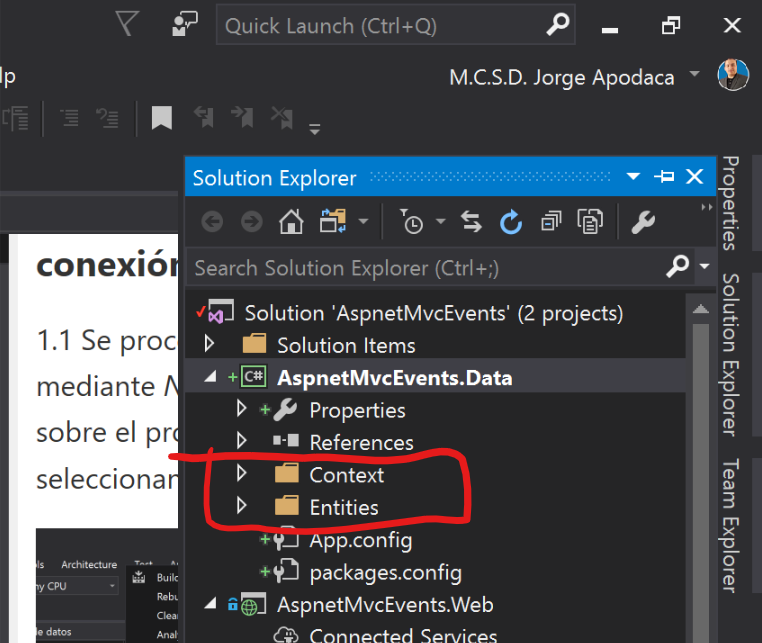
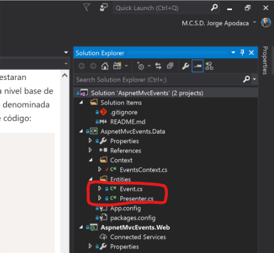
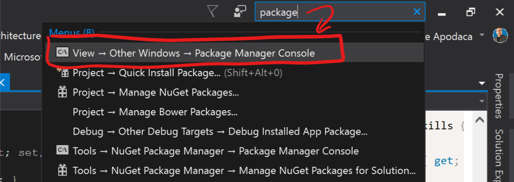
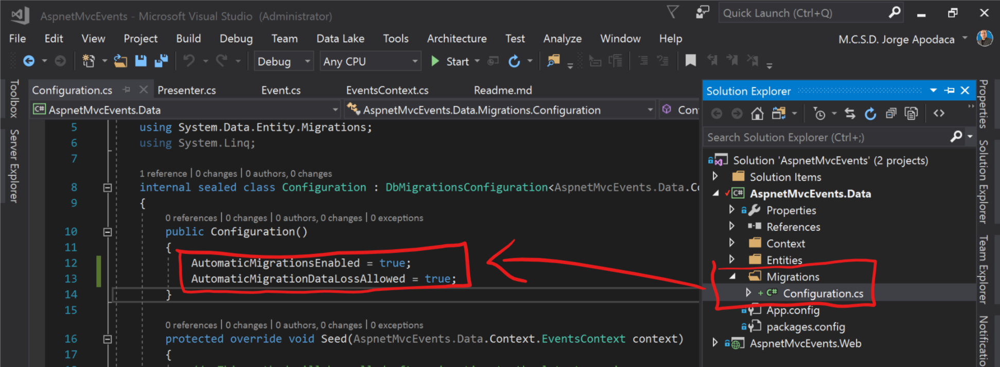
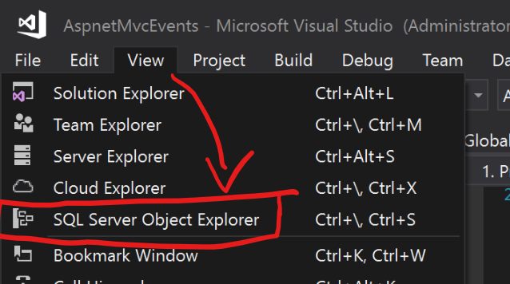
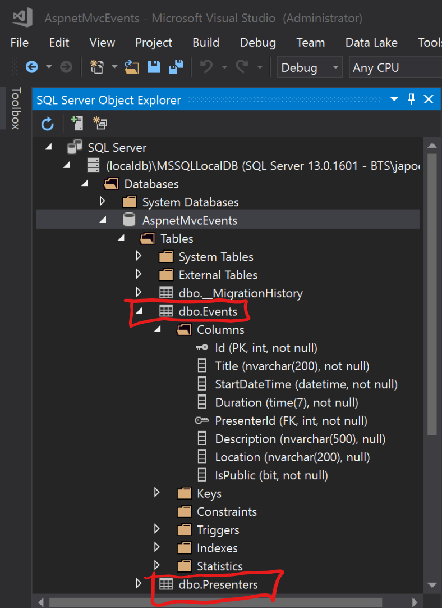
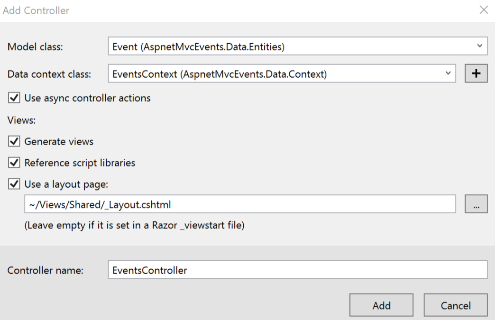
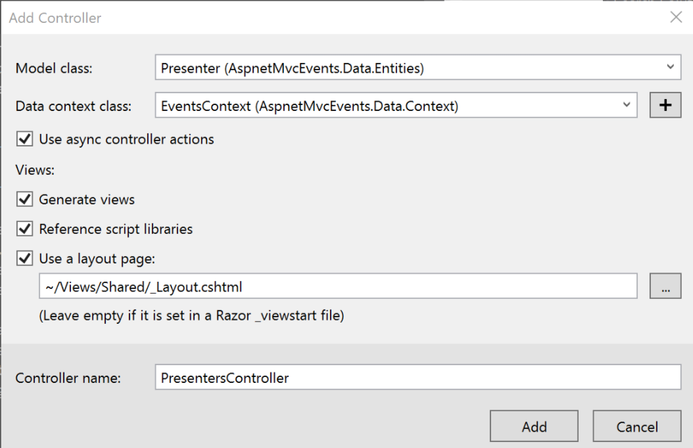
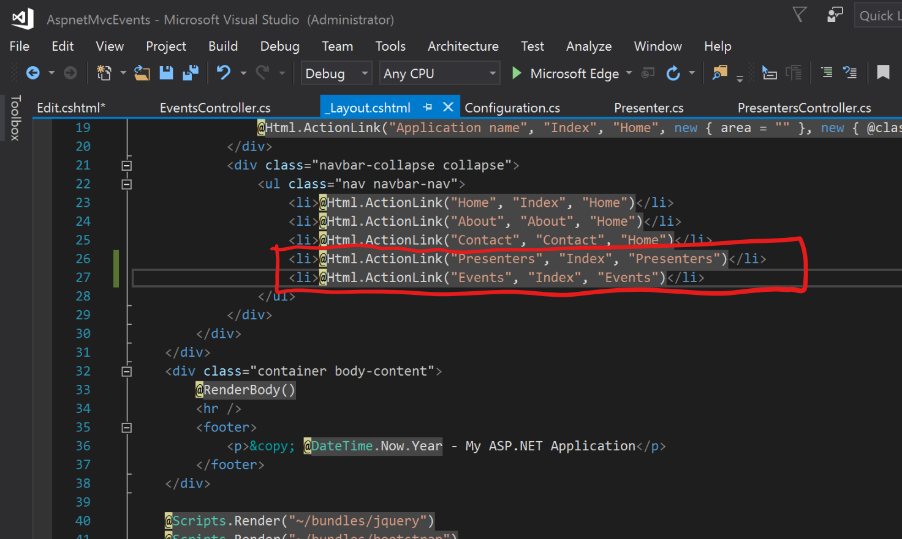

# Hands-On-Lab

### Caso de Estudio

Se procedera a crear un sitio web basado en ***ASP.NET MVC***, en donde se lleve el control de registro de eventos y presentadores en una convención, registrando dicha informacion por medio de un ***ORM*** como lo es ***Entity Framework*** alojandola en ***SQL Server Express Edition***.

#### Ejercicios

Realizar los siguientes ejercicios del hands-on lab:

1. [Preparar la solución para la conexión hacia la base de datos](#1-preparar-la-solución-para-la-conexión-hacia-la-base-de-datos)
2. [Creando la base de datos por medio de Migrations de Entity Framework](#2-creando-la-base-de-datos-por-medio-de-migrations-de-entity-framework)
3. [Finalmente compilar la version ejecutar el resultado final.](#3-finalmente-compilar-la-version-ejecutar-el-resultado-final)

> Tiempo estimado para terminar este hands-on lab: **120 minutos**

#### 1. Preparar la solución para la conexión hacia la base de datos

1.1 Se procede a instalar Entity Framework mediante *NuGet Packages* dando click derecho sobre el proyecto **AspnetMvcEvents.Web** seleccionando la opcion **`Manage NuGet Packages`**


1.2 Posteriormente, agregar la seccion `connectionStrings` en el archivo **`web.config`** con los datos de conexion a la base de datos donde será alojada la información:


Texto en archivo `web.config`

```xml
<connectionStrings>
	<add name="AspnetMvcEvents"
			connectionString="Data Source=(localdb)\MSSQLLocalDB;Database=Events;Integrated Security=True"
			providerName="System.Data.SqlClient" />
</connectionStrings>
```

1.3 Agregar nuevo proyecto a la solucion denominado **"AspnetMvcEvents.Data"** de tipo `Class Library (.NET Framework)` y borrar el archivo *Class1.cs* que se genera por defecto.

1.4 En el proyecto del punto anterior también se deberá habilitar **Entity Framework 6** por medio de NuGet Packages.

1.5 Agregar el mismo *connectionString* del punto **1.2** pero ahora en el archivo `App.config` dentro del proyecto `AspnetMvcEvents.Data` con la finalidad de ser utilizado para la ejecucion de Migrations con **Entity Framework**.

1.6 Crear dos carpetas dentro del proyecto AspnetMvcEvents.Data deniminadas **Context** y **Entities** como se muestra en la siguiente imagen:



1.7 Ya creadas las carpetas se procede a crear el contexto donde estaran especificadas las entidades que representaran a las tablas fisicas a nivel base de datos (Proceso de Mapping de Entity Framework), crear una clase denominada **"EventsContext.cs"** dentro del folder **"Context"** con el siguiente código:

```csharp
using AspnetMvcEvents.Data.Entities;
using System;
using System.Collections.Generic;
using System.Data.Entity;
using System.Linq;
using System.Text;
using System.Threading.Tasks;

namespace AspnetMvcEvents.Data.Context
{
    public class EventsContext : DbContext
    {
        public EventsContext()
            : base("AspnetMvcEvents") { }

		#region Entidades por DbSet

		public DbSet<Event> Events { get; set; }
		public DbSet<Presenter> Presenters { get; set; }

		#endregion
	}
}
```

1.8	Posteriormente se proceden a crear las entidades que estaran ligadas por medio de EF hacia su respectiva tabla de base de datos como lo es **Event** y **Presenter** dentro de la carpeta **Entities** con el siguiente codigo respectivamente:



```csharp
/*************************
Modelo o Entidad Event.cs
**************************/
using System;
using System.Collections.Generic;
using System.ComponentModel.DataAnnotations;
using System.ComponentModel.DataAnnotations.Schema;
using System.Linq;
using System.Text;
using System.Threading.Tasks;

namespace AspnetMvcEvents.Data.Entities
{
	public class Event
	{
		public Event()
		{
			this.IsPublic = true;
			this.StartDateTime = DateTime.Now;
		}

		public int Id { get; set; }

		[Required]
		[MaxLength(200)]
		public string Title { get; set; }

		[Required]
		public DateTime StartDateTime { get; set; }

		[Required]
		public TimeSpan? Duration { get; set; }
		
		[Required]
		public virtual int PresenterId { get; set; }

		[MaxLength(500)]
		public string Description { get; set; }

		[MaxLength(200)]
		public string Location { get; set; }

		public bool IsPublic { get; set; }

		[ForeignKey("PresenterId")]
		public virtual Presenter Presenter { get; set; }
	}
}
```

```csharp
/******************************
Modelo o Entidad Presenter.cs
*******************************/
using System;
using System.Collections.Generic;
using System.ComponentModel.DataAnnotations;
using System.Linq;
using System.Text;
using System.Threading.Tasks;

namespace AspnetMvcEvents.Data.Entities
{
	public class Presenter
	{
		public Presenter() { }

		public int Id { get; set; }
		[Required]
		[MaxLength(20)]
		public string Name { get; set; }
		[Required]
		[MaxLength(30)]
		public string Lastname { get; set; }
		[Required]
		[MaxLength(500)]
		public string ProfessionalSkills { get; set; }

		public virtual ICollection<Event> Events { get; set; }
	}
}
```

1.9 Una vez habilitado el contexto donde estaran definiendose las entidades que representaran a las tablas de una base de datos, se procede a habilitar Migrations de EF sobre el proyecto *AspnetMvcEvents.Data* ejecutando la siguiente instruccion por medio de **Package Manager Console** que se abre dando la siguiente combinacion de teclas **`Ctrl+Q`** esribiendo `package` en el **"Quick Launch"** y seleccionar la primera opcion:



La instrucción a ejecutar es la siguiente:
```
PM> Enable-Migrations -ProjectName AspnetMvcEvents.Data -StartUpProjectName AspnetMvcEvents.Data -ConnectionStringName AspnetMvcEvents -Verbose
```

#### 2. Creando la base de datos por medio de Migrations de Entity Framework

2.1 Una vez habilitado Migrations de EF, aparecera una nueva carpeta en el proyecto **"AspnetMvcEvents.Data"** denominada **"Migrations"** el cual contiene la clase "Configuration.cs" que definira el comportamiento de instrucciones realizadas para Migrations de EF. Se procede a modificar las lineas de codigo como aparecen en la siguiente imagen:



2.2 Agregar inyeccion de datos iniciales en las entidades **Event** y **Presenter** en el metodo ***Seed*** del mismo archivo ***Configuration.cs*** con el siguiente codigo:

```csharp
protected override void Seed(AspnetMvcEvents.Data.Context.EventsContext context)
{
	context.Presenters.AddOrUpdate(p => p.Name,
		new Presenter
		{
			Name = "Jorge Mario",
			Lastname = "Apodaca Mendoza",
			ProfessionalSkills = "Skills in TFS, Sencha ExtJS, C#, Oracle, SQL Server, CI/CD, DevOps, SCRUM, AWS, Azure",
			Events = new List<Event>()
			{
				new Event { Title = "Curso de ASP.NET MVC", Description = "Curso de ASP.NET MVC", Duration = TimeSpan.Parse("4:00"), IsPublic = true, Location = "Mexicali, B.C." },
				new Event { Title = "Team Foundation Server", Description = "Curso de Team Foundation Server", Duration = TimeSpan.Parse("6:00"), IsPublic = true, Location = "Guadalajara, Jalisco" }
			}
		},
		new Presenter
		{
			Name = "Ricardo",
			Lastname = "Lopez Medina",
			ProfessionalSkills = "Office 365, TFS",
			Events = new List<Event>()
			{
				new Event { Title = "Curso de Office 365", Description = "Curso de Office 365", Duration = TimeSpan.Parse("2:00"), IsPublic = false, Location = "Mexicali, B.C." },
				new Event { Title = "Curso de Nominas", Description = "Curso de Nominas", Duration = TimeSpan.Parse("1:30"), IsPublic = true, Location = "C.D. de Mexico" }
			}
		});
}
```

2.3 Una vez especificada la inyeccion de datos prueba, para asegurarnos de que pueda ejecutarse dicha inyeccion o cualquier modificacion a las entidades sea ejecutada toda instruccion automaticamente, debemos especificar la siguiente instruccion dentro del metodo **Application_Start** en el archivo **"Global.asax"** dentro del proyecto **"AspnetMvcEvents.Web"**:

```csharp
Database.SetInitializer(new MigrateDatabaseToLatestVersion<EventsContext, Configuration>());
```

2.4 La instruccion anterior marcara error debido a que hace falta una referencia hacia el proyecto AspnetMvcEvents.Data dentro del proyecto **"AspnetMvcEvents.Web"**. Una vez realizada la referencia corregir el error agregando su respectivo "using" en codigo fuente. Adicionalmente modificar el tipo de clase del archivo "Configuration.cs" dentro del folder Migrations a como sigue:

```csharp
// ANTES
internal sealed class Configuration : DbMigrationsConfiguration<AspnetMvcEvents.Data.Context.EventsContext>
```

```csharp
// DESPUES
public class Configuration : DbMigrationsConfiguration<AspnetMvcEvents.Data.Context.EventsContext>
```

2.5 Se procede a generar el archivo de Migrations con todo cambio que se tenga al momento de las entidades o instrucciones por Fluent API ejecutando la siguiente instruccion en **"Package Manager Console"** como sigue:

```
PM> Add-Migration -Name EstructuraInicial -ProjectName AspnetMvcEvents.Data -StartUpProjectName AspnetMvcEvents.Data -ConnectionStringName AspnetMvcEvents -Verbose
```

2.6 El punto anterior abrira el archivo de Migrations generando las instrucciones debidas para generar ya sea un archivo SQL o ejecutar directamente en la base de datos dichas instrucciones de adicion o alteracion. Ahora, procedemos a ejecutar directamente en la Base de Datos las instrucciones del archivo que acabamos de generar de Migrations corriendo la siguiente instruccion en **"Package Manager Console"**:

```
PM> Update-Database -ProjectName AspnetMvcEvents.Data -StartUpProjectName AspnetMvcEvents.Data -ConnectionStringName AspnetMvcEvents -Verbose
```

2.7 La instruccion anterior creara la estructura de tablas iniciales en la base de datos por lo que se puede comprobar abriendo la opcion **"SQL Server Object Explorer"** ubicado en el manu **"View"** como se muestra en la siguiente imagen:





2.8 Posteriormente generamos un CRUD completo con la ayuda de la operacion "scafold de ASP.NET MVC" dando click derecho sobre el folder "Controllers" del proyecto "AspnetMvcEvents.Web" despues ir a **"Add"** y seleccionar la primer opcion **"controller"**, lo anterior abrira una ventana para seleccionar el tipo de template con el cual creara el CRUD completo en base a la entidad que seleccionemos, seleccionar el template **"MVC 5 Controllers with view using Entity Framework"** y posteriormente llenar los datos en base a la siguiente imagen:

Eventos:


Presentadores:


2.9 Por ultimo agregamos los enlaces en la pagina principal que van directamente a los dos CRUD "Events" y "Presenters" agregando las siguientes lineas en el archivo **"_Layout.cshtml"** que se encuentra en el proyecto **"AspnetMvcEvents.Web"** bajo el folder **"Views\Shared"**:

```html
<li>@Html.ActionLink("Presenters", "Index", "Presenters")</li>
<li>@Html.ActionLink("Events", "Index", "Events")</li>
```
>**NOTA:** Las lineas anteriores deberan ir ubicadas dentro de la seccion de navegacion de la pagina principal como aparece en la siguiente imagen...



#### 3. Finalmente compilar la version ejecutar el resultado final.

Aqui termina el Hands-on Lab de ASP.NET MVC con Entity Framework.