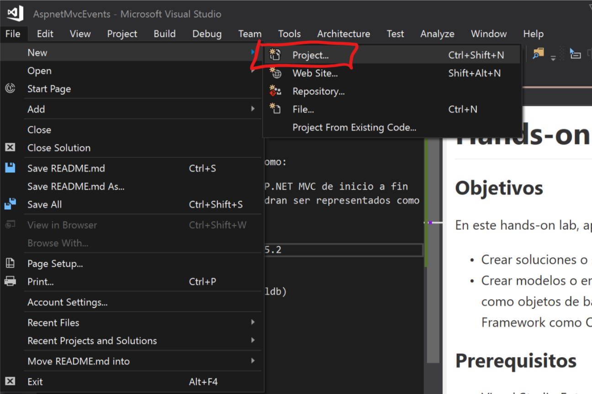

# Hands-on Lab

### Objetivos

En este hands-on lab, aprenderas como:

- Crear soluciones o sitios web ASP.NET MVC de inicio a fin
- Crear modelos o entidades que podran ser representados como objetos de base de datos con la ayuda de Entity Framework como ORM (***Object-Relational Mapping***).

### Prerequisitos

- Visual Studio Enterprise 2017 v15.2
- ASP.NET MVC 5
- Entity Framework 6
- SQL Server Express Edition (localdb)

> **NOTA:** En caso de no contar con Visual Studio 2017, favor de descargar o clonar este proyecto y una vez alojado localmente, crear una solucion en el directorio raiz con la version de Visual Studio con la que se cuente y agregar la referencia de los subproyectos a dicha solución.

Preparación de la solución:

1. En caso de no contar con la version de VS2017, seguir la NOTA anterior.
2. Una vez descargado y abierta la solución en Visual Studio proceder a restablecer todo paquete faltante a nivel solucion como se muestra en la siguiente imagen:

3. Una vez preparada la solución, se procede a dar inicio a las instrucciones del **"Hands-on Lab"** dando **[CLICK AQUI](AspnetMvcEvents.Web#Hands-On-Lab)**

#### Autor del Hands-on Lab:

- **Nombre:** M.C.S.D. Jorge Apodaca
- **Título:** Microsoft Certified Solutions Developer
- **Website:** https://github.com/licjapodaca
- **Email:** mcsd@jorge-apodaca.net
- **Twitter:** @licjapodaca
