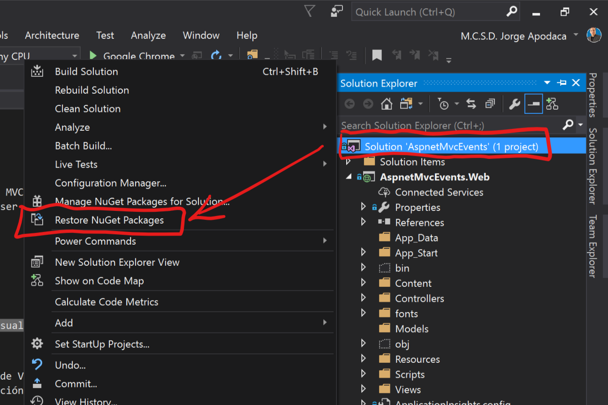

# Hands-on Lab

### Objetivos

En este hands-on lab, aprenderas como:

- Crear soluciones o sitios web ASP.NET MVC de inicio a fin
- Crear modelos o entidades que podran ser representados como objetos de base de datos con la ayuda de Entity Framework como ORM (***Object-Relational Mapping***).

### Prerequisitos

- Visual Studio Enterprise 2017 v15.2
- ASP.NET MVC 5
- Entity Framework 6
- SQL Server Express Edition (localdb)

